## Kim Jae Young

### Profile
B.S in Biomedical engineering and Computer Engineering in [Gachon][1] 
Researcher of [Teamlab][30]
 

### Interest

    Machine Learning , Image processing

***

### Personal projects

##### Deep Learning paper implements

* ALexNet [[paper][3]] [[code][4]]
* Convolution Neural Networks [[code][6]]
* Relational Networks [[paper][7]] [[code][8]]
* Deep Convolutional Generative Adversarial Networks [[paper][9]] [[code][10]]
* Seq2seq simple chatbot [[paper][13]] [[code][14]]
* CapsNet [[paper][15]] [[code][16]]
* YoLo [[paper][17]] [[code][18]]
* FCN [[paper][19]] [[code][20]]
* Show attend and tell of image captioning [[paper][21]] [[code][22]]

##### projects

###### brain disease prediction 

[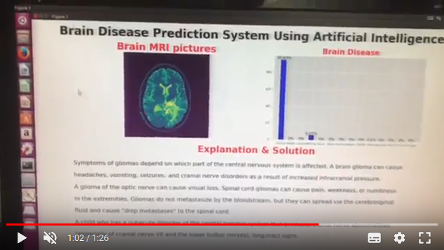](https://youtu.be/5QrdDLqG3xw)

###### video object detection

[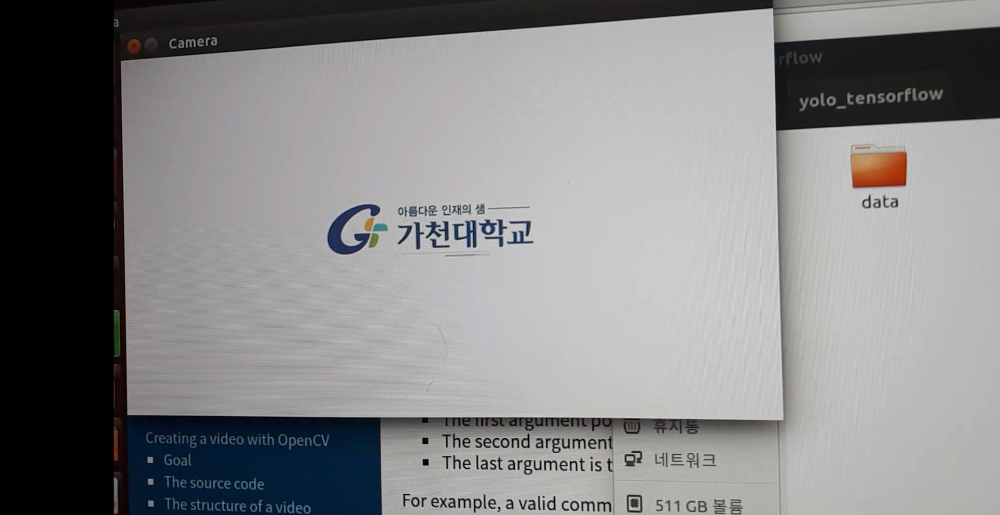](https://youtu.be/OvjtCKlgWD4)

###### android community application 

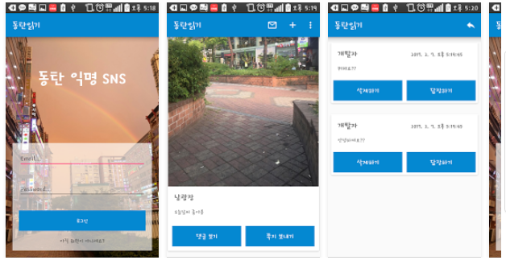 

[link here][23]

###### simple chatbot

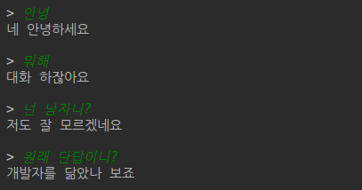 

[code][14]

###### transform show attend and tell model to top-k show attend and tell

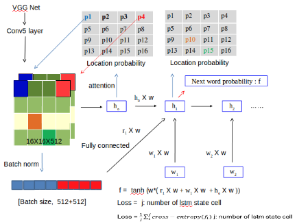 

[code][22]

***

### presentation

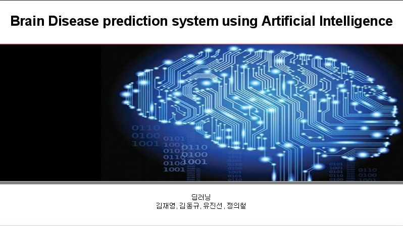

[presentation brain disease][24]

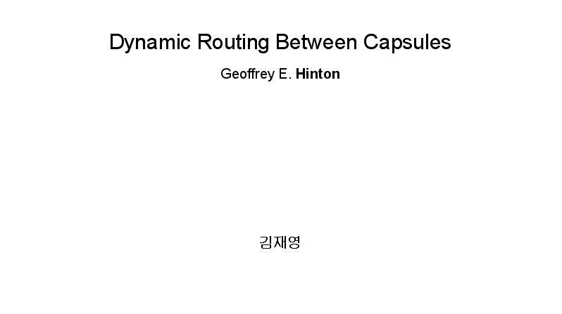

[presentation CapsNet][25]

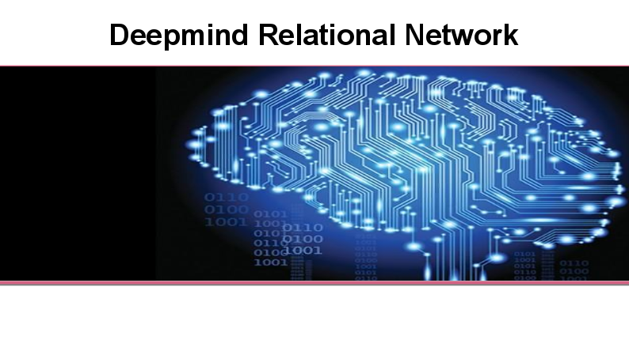

[presentation Deepmind relation network][26]

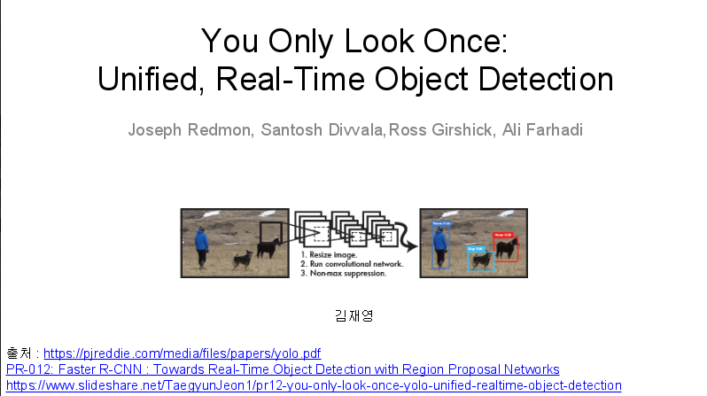

[presentation YoLo][27]

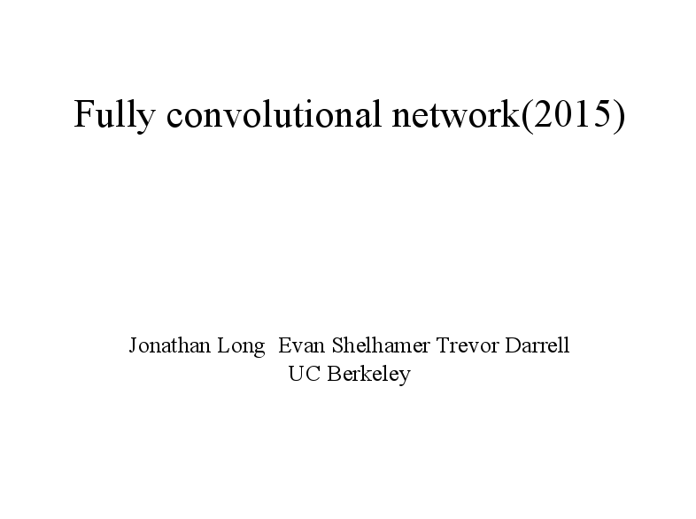

[presentation FCN][28]

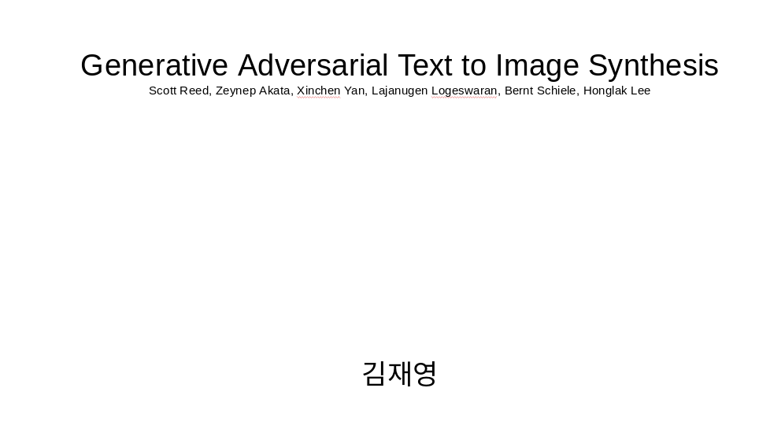

[presentation DCGAN][29]

[presentation show attend and tell][31]

[31]:https://drive.google.com/open?id=15cw1PWWDt7r5B_sbN2GvT9TQ0pIA78p3
[24]:https://drive.google.com/open?id=0B13iRp-H60h5Y1lmZllFOFBlUGc
[25]:https://drive.google.com/open?id=1_X7OyHzgphZccsS04_-TFcYrl4rEvV1B
[26]:https://drive.google.com/open?id=0B13iRp-H60h5RU1xM3dZc3JvUm8
[27]:https://drive.google.com/open?id=0B13iRp-H60h5RzZyT0VFcDVOT0E
[28]:https://drive.google.com/open?id=0B13iRp-H60h5RmdicVJqLWlPUmc
[29]:https://drive.google.com/open?id=1-m83iNYeF3gGH9OtRtWavLT_vYWWSpJY3PQPu6mGfpA
[1]:https://www.gachon.ac.kr
[2]:https://github.com/kimjeyoung
[5]:https://github.com/kimjeyoung
[6]:https://github.com/kimjeyoung/Machine-Learning/blob/master/cnn_custom_image/Convolution_neural_network.ipynb
[7]:https://arxiv.org/abs/1706.01427
[8]:https://github.com/kimjeyoung/deep_image_101/blob/master/relational%20network/Relation_network.ipynb
[9]:https://arxiv.org/abs/1511.06434
[10]:https://github.com/kimjeyoung/deep_image_101/tree/master/DCGAN
[11]:https://arxiv.org/abs/1605.05396
[12]:https://github.com/kimjeyoung
[13]:https://arxiv.org/abs/1409.3215
[14]:https://github.com/kimjeyoung/Machine-Learning/tree/master/ChatBot
[15]:https://arxiv.org/abs/1710.09829
[16]:https://github.com/kimjeyoung/deep_image_101/blob/master/CapsNet/CapsNet.ipynb
[17]:https://arxiv.org/abs/1506.02640
[18]:https://github.com/kimjeyoung/deep_image_101/tree/master/YOLO1
[19]:https://people.eecs.berkeley.edu/~jonlong/long_shelhamer_fcn.pdf
[20]:https://github.com/kimjeyoung/deep_image_101/tree/master/fcn
[21]:https://arxiv.org/abs/1502.03044
[22]:https://github.com/kimjeyoung/Machine-Learning/tree/master/Show_Attend_Tell
[23]:https://play.google.com/store/search?q=%EB%8F%99%ED%83%84%EC%9D%BD%EA%B8%B0&hl=ko
[3]:https://papers.nips.cc/paper/4824-imagenet-classification-with-deep-convolutional-neural-networks.pdf
[4]:https://github.com/kimjeyoung/Machine-Learning/blob/master/Alexnet/Alexnet.ipynb
[30]:http://theteamlab.io

email: agus[at]python.web.id
